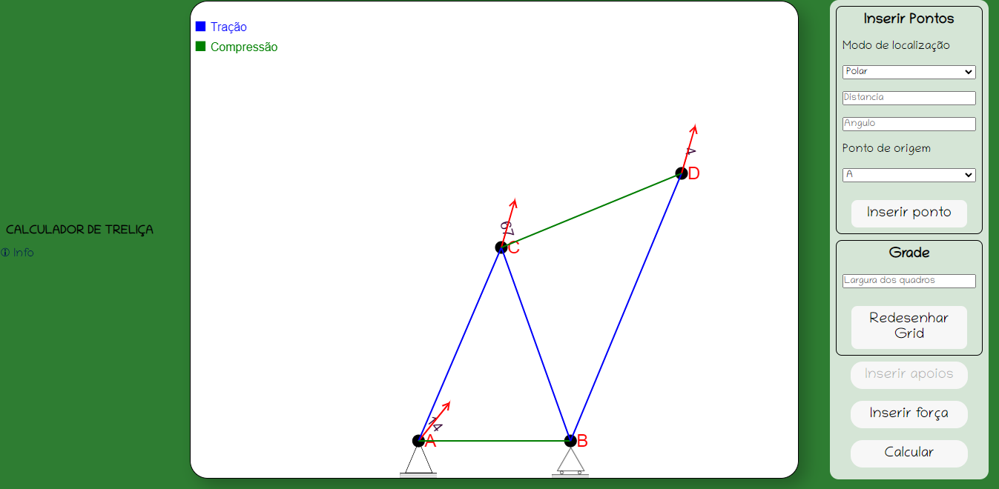
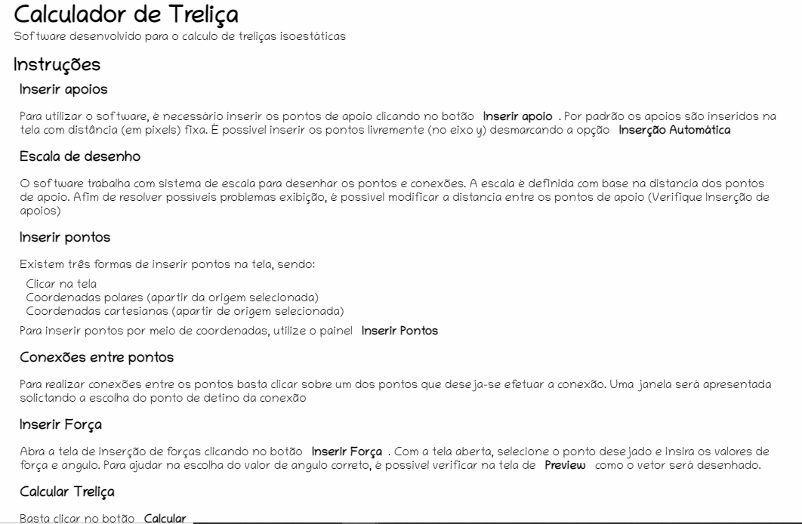

## Projeto Calculador de treliças

Projeto WEB de software para calcular as forças e reações de treliças isoestáticas para a disciplina de RESMAT




### Execução

Para executar a aplicação, abra o arquivo **index.html**

### Instruções de uso

A figura abaixo exibem as instruções de uso



### Login

Use as credenciais abaixo:

```
    login = EC4
    senha = EC4
```